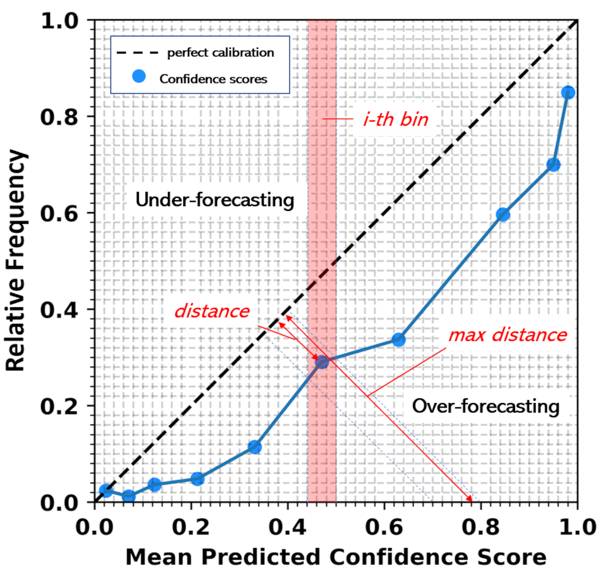

<div align="center">
  
  <h1 style="display: inline-block;">CalFram: A Comprehensive Framework for Calibration Assessment</h1>
</div>

## Introduction

Calibration is a multidimensional concept essential for assessing machine learning models. It helps understand a model's global calibration performance, identify miscalibrated regions of the probability space, and determine the level of overconfidence or underconfidence of a model. Therefore, multi-dimensionality is critical to gain a thorough understanding of a machine learning model's performance and limitations.

<p align="center">
  
</p>

To address the above concerns, we developed CalFram - a comprehensive framework for assessing calibration for binary and multiclass classification models. This framework relies on the Estimated Calibration Index (ECI). 

The higher the ECI, the better the calibration.

Our framework offers various calibration metrics for a holistic evaluation of your model's calibration. It works directly with numpy arrays, making it model-agnostic. These metrics include:

- **Global Measures (ECI<sub>g</sub>)**: For an overall assessment of the model's calibration. Bounds [0,1], 0 is totally non-calibrated, 1 is perfectly calibrated.
- **Local Measures (ECI<sub>l</sub>)**: To provide detailed insight into the model's performance in specific regions of the input space. The bounds are the same as the global measure.
- **Balance Measures (ECI<sub>b</sub>)**: To quantify how much the model is overconfident or underconfident. Bounds [-1, 1], -1 is totally underconfident, 1 is totally overconfident, and 0 is the trade-off. 
- **Overconfident and Underconfident Area Metrics (ECI<sub>over</sub>, ECI<sub>under</sub>)**: To highlight parts of the input space where the model is especially overconfident or underconfident. The bounds are the same as the global measure.
- **ECE Accuracy based formulation**
- **ECE Frequency based formulation**
- **Brier Score Loss** (Note: for both binary and multiclass, the brier score loss is bounded in [0,1]).

Together, these measures provide a complete understanding of your model's calibration and help to make targeted modifications to improve the model. Our framework works directly with any model's outputs, making it agnostic to any Machine Learning and Deep Learning framework.

## Installation

1. Clone the repository:
   ```bash
   git clone https://github.com/lorenzofamiglini/CalFram.git
   ```

2. Change to the project directory:
   ```bash
   cd CalFram
   ```

3. (Optional) Create and activate a virtual environment:
   ```bash
   python -m venv venv
   source venv/bin/activate  # On Windows, use `venv\Scripts\activate`
   ```

4. Install the required dependencies:
   ```bash
   pip install -r requirements.txt
   ```

## Example

```python
from calfram.calibration_framework import CalibrationFramework

# Your model predictions and actual values
y_pred = ...  # shape: (n, 1)
y_true = ...  # shape: (n, 1)
y_prob = ...  # shape: (n, c), where c is the number of classes 

# Create an instance of CalibrationFramework
cf = CalibrationFramework()

# Prepare data for calibration analysis
classes_scores = cf.select_probability(y_true, y_prob, y_pred)

# Compute all the metrics based on 15 bins with equal-width
measures, binning_dict = cf.calibrationdiagnosis(classes_scores, strategy=15, adaptive=False)
# Or, compute all the metrics based on automatic monotonic sweep method for identifying the right number of bins 
measures, binning_dict = cf.calibrationdiagnosis(classes_scores, adaptive=True)

# The 'measures' dictionary contains the following structure for each class:
measures = {
    'class_0': { 
        'ece_acc': float,  # Expected Calibration Error for accuracy for class '0'
        'ece_fp': float,  # Expected Calibration Error for freq positives for class '0'
        'ec_g': float,  # A measure of global Estimated Calibration Index for class '0'
        'ec_under': np.ndarray,  # Estimated Calibration Index for under-confident predictions for class '0'
        'under_fr': np.ndarray,  # Relative frequency of under-confident predictions for class '0'
        'ec_over': np.ndarray,  # Estimated Calibration Index for over-confident predictions for class '0'
        'over_fr': np.ndarray,  # Relative frequency of over-confident predictions for class '0'
        'ec_underconf': float,  # A measure of under-confidence across all predictions for class '0'
        'ec_overconf': float,  # A measure of over-confidence across all predictions for class '0'
        'ec_dir': float,  # A measure of the general direction of miscalibration for class '0'
        'brier_loss': float,  # Brier score loss for class '0'
        'over_pts': np.ndarray,  # Points that represent over-confident predictions for class '0'
        'under_pts': np.ndarray,  # Points that represent under-confident predictions for class '0'
        'ec_l_all': np.ndarray,  # All local Estimated Calibration measures for class '0'
        'where': np.ndarray,  # An array indicating where each bin falls for class '0'
        'relative-freq': np.ndarray,  # The relative frequencies of the samples falling into each bin for class '0'
        'x': np.ndarray,  # The mean predicted confidence of each bin for class '0'
        'y': np.ndarray,  # The estimated probability or actual accuracy of each bin for class '0'
    },
    'class_1': {
        # ... Same structure as above, but for class '1'
    },
    # ... The same structure would be repeated for each class
}

# For general overall measure without dividing per class:
class_wise_metrics = cf.classwise_calibration(measures)

class_wise_metrics = {
    'ec_g': float,  # ECI_global
    'ec_dir': float,  # ECI_balance
    'ece_freq': float,  # ECE based on freq. of positive
    'ece_acc': float,  # ECE based on Accuracy
    'ec_underconf': float,  # ECI global for the underconfident area
    'ec_overconf': float,  # ECI global for the overconfident area
    'brierloss': float  # Brier Loss cw bounded in 0,1
}

# Generate reliability plot
cf.reliabilityplot(classes_scores, strategy=15, split=False)
```

## Visualization

To generate a reliability plot:

```python
import matplotlib.pyplot as plt

plt.figure(figsize=(10, 10))
cf.reliabilityplot(classes_scores, strategy=15, split=False)
plt.title("Reliability Plot")
plt.xlabel("Mean Predicted Value")
plt.ylabel("Fraction of Positives")
plt.show()
```

## Contributing
We welcome contributions to this project. Please feel free to open issues or submit pull requests.

## Citations

If you find this project useful in your research, please consider citing:

```bibtex
@inproceedings{famiglini2023calibration,
  title={Towards a Rigorous Calibration Assessment Framework: Advancements in Metrics, Methods, and Use},
  author={Famiglini, Lorenzo and Campagner, Andrea and Cabitza, Federico},
  booktitle={European Conference on Artificial Intelligence},
  pages={},
  year={2023},
  address={Kraków, Poland},
  publisher={},
  date={30.09 - 5.10}
}
```

## License
This project is open source and licensed under the MIT license. See the LICENSE file for more information.
