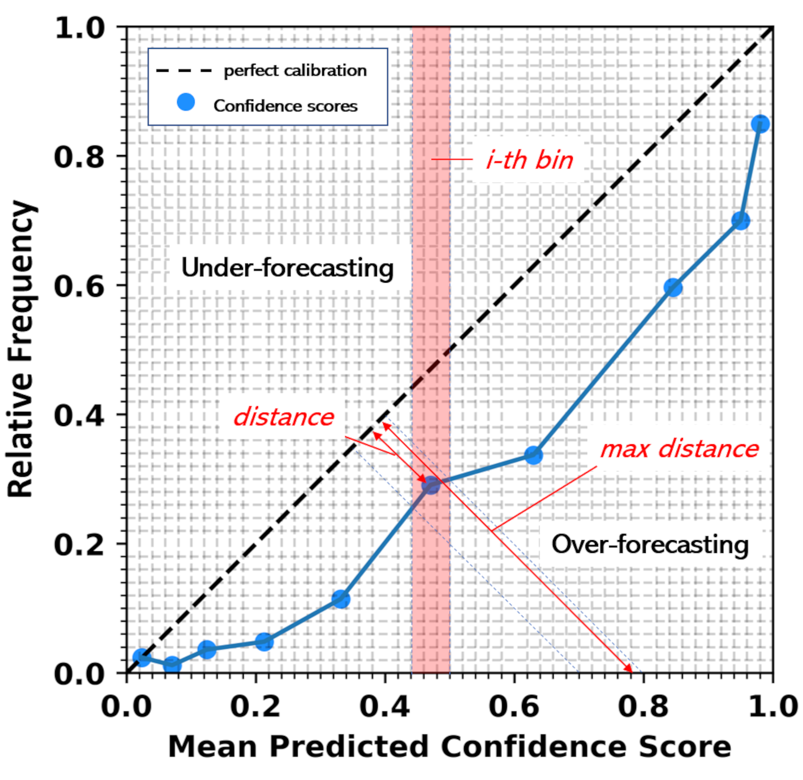

<div align="center">
  
  <h1 style="display: inline-block;">CalFram: A Comprehensive Framework for Calibration Assessment</h1>
</div>

## Introduction

Calibration is a multidimensional concept essential for assessing machine learning models. It helps understand a model's global calibration performance, identify miscalibrated regions of the probability space, and determine the level of overconfidence or underconfidence of a model. Therefore, multi-dimensionality is critical to gain a thorough understanding of a machine learning model's performance and limitations.

<p align="center">
  
</p>

To address the above concerns, we developed CalFram - a comprehensive framework for assessing calibration for binary and multiclass classification models. This framework relies on the Estimated Calibration Index (ECI). 

The higher the ECI, the better the calibration.

Our framework offers various calibration metrics for a holistic evaluation of your model's calibration. It works directly with numpy arrays, making it model-agnostic. These metrics include:

- **Global Measures (ECI<sub>g</sub>)**: For an overall assessment of the model's calibration. Bounds [0,1], 0 is totally non-calibrated, 1 is perfectly calibrated.
- **Local Measures (ECI<sub>l</sub>)**: To provide detailed insight into the model's performance in specific regions of the input space. The bounds are the same as the global measure.
- **Balance Measures (ECI<sub>b</sub>)**: To quantify how much the model is overconfident or underconfident. Bounds [-1, 1], -1 is totally underconfident, 1 is totally overconfident, and 0 is the trade-off. 
- **Overconfident and Underconfident Area Metrics (ECI<sub>over</sub>, ECI<sub>under</sub>)**: To highlight parts of the input space where the model is especially overconfident or underconfident. The bounds are the same as the global measure.
- **ECE Accuracy based formulation**
- **ECE Frequency based formulation**
- **Brier Score Loss** (Note: for both binary and multiclass, the brier score loss is bounded in [0,1]).
- **Signed Index (ECI<sub>signed</sub>)** (new in 0.2.0): the direction of miscalibration on the same bins as ECI<sub>g</sub>, each side weighted by its mass. Bounds [-1, 1], positive where predictions exceed outcomes.
- **Tie-safe binning** (new in 0.2.0): `strategy='pooled_sweep'`, a binning that never splits scores that are equal, for models whose scores take few distinct values.
- **Ideal value** (new in 0.2.0): `ideal_calibration`, what every measure would be if the model were perfectly calibrated with these probabilities on these items, with an interval and a p-value.

Together, these measures provide a complete understanding of your model's calibration and help to make targeted modifications to improve the model. Our framework works directly with any model's outputs, making it agnostic to any Machine Learning and Deep Learning framework.

## Tie-safe binning, a signed index, and the ideal value

Three additions for scores that take few distinct values (a 0.01 grid, a rounded API
output, a small model), where ordinary binning breaks down.

**`strategy='pooled_sweep'`**: a binning that never splits a tied block. It starts from
one bin per distinct score and pools adjacent bins whose observed frequencies violate
monotonicity (pool-adjacent-violators, the isotonic regression of the outcome on the
score). Quantile edges and the adaptive sweep cut through tied blocks, so their result
depends on the order of the rows; this one depends only on the counts per value.

**`ec_signed`**: a signed companion to ECI<sub>g</sub> on the same bins,
Σ<sub>b</sub> w<sub>b</sub> (x<sub>b</sub> − y<sub>b</sub>) / max(x<sub>b</sub>, 1 − x<sub>b</sub>),
positive where predictions exceed outcomes. Unlike ECI<sub>b</sub>, which averages within
each side, it weights each side by its mass, so it says which way the model is wrong on
balance. `ec_signed_over` and `ec_signed_under` are its two sides.

**`ideal_calibration`**: what a perfectly calibrated model with *these* probabilities
would score on *these* items. ECI<sub>g</sub> is 1 only in the limit; on a finite sample
a perfect model scores below 1, and a binned ECE above 0, by an amount that depends on the
sample size, on how many distinct scores there are and on how many bins the binning ends
up with. The ideal value is simulated: labels are drawn from the model's own probabilities
(so the model is calibrated by construction), the whole diagnosis is rerun, binning
included, and the mean over draws is reported, with an interval and a Monte Carlo
p-value for the observed value. Read the gap to the ideal, not the raw index.

```python
from calfram.calibration_framework import CalibrationFramework

cf = CalibrationFramework()
classes_scores = cf.select_probability(y_true, y_prob, y_pred)
measures, bins = cf.calibrationdiagnosis(classes_scores, strategy='pooled_sweep')
measures['1']['ec_g'], measures['1']['ec_signed']

ideal = cf.ideal_calibration(y_true, y_prob, y_pred, strategy='pooled_sweep', n_sim=1000, seed=0)
ideal['1']['ec_g']      # {'observed': ..., 'ideal': ..., 'std': ..., 'ci': (lo, hi), 'p_value': ..., 'direction': 'less'}
```

`n_sim` draws cost `n_sim` calls of `calibrationdiagnosis`; 200 is enough for the ideal
value, 1,000 or more for a p-value below 0.01. These were developed for the audit of a
model that returns probabilities on a 0.01 grid, where the tie-safe binning changed the
sign of the balance on several tasks and the ideal value separated finite-sample noise
(about 0.02 in ECE at n = 2,500) from miscalibration of the same size.

## Installation

1. Clone the repository:
   ```bash
   git clone https://github.com/lorenzofamiglini/CalFram.git
   ```

2. Change to the project directory:
   ```bash
   cd CalFram
   ```

3. (Optional) Create and activate a virtual environment:
   ```bash
   python -m venv venv
   source venv/bin/activate  # On Windows, use `venv\Scripts\activate`
   ```

4. Install the required dependencies:
   ```bash
   pip install -r requirements.txt
   ```

## Example

```python
from calfram.calibration_framework import CalibrationFramework

# Your model predictions and actual values
y_pred = ...  # shape: (n, 1)
y_true = ...  # shape: (n, 1)
y_prob = ...  # shape: (n, c), where c is the number of classes 

# Create an instance of CalibrationFramework
cf = CalibrationFramework()

# Prepare data for calibration analysis
classes_scores = cf.select_probability(y_true, y_prob, y_pred)

# Compute all the metrics based on 15 bins with equal-width
measures, binning_dict = cf.calibrationdiagnosis(classes_scores, strategy=15, adaptive=False)
# Or, compute all the metrics based on automatic monotonic sweep method for identifying the right number of bins 
measures, binning_dict = cf.calibrationdiagnosis(classes_scores, adaptive=True)
# Or, with the tie-safe binning: one bin per distinct score, pooled until monotone, ties never split
measures, binning_dict = cf.calibrationdiagnosis(classes_scores, strategy='pooled_sweep')

# The 'measures' dictionary contains the following structure for each class:
measures = {
    'class_0': { 
        'ece_acc': float,  # Expected Calibration Error for accuracy for class '0'
        'ece_fp': float,  # Expected Calibration Error for freq positives for class '0'
        'ec_g': float,  # A measure of global Estimated Calibration Index for class '0'
        'ec_under': np.ndarray,  # Estimated Calibration Index for under-confident predictions for class '0'
        'under_fr': np.ndarray,  # Relative frequency of under-confident predictions for class '0'
        'ec_over': np.ndarray,  # Estimated Calibration Index for over-confident predictions for class '0'
        'over_fr': np.ndarray,  # Relative frequency of over-confident predictions for class '0'
        'ec_underconf': float,  # A measure of under-confidence across all predictions for class '0'
        'ec_overconf': float,  # A measure of over-confidence across all predictions for class '0'
        'ec_dir': float,  # A measure of the general direction of miscalibration for class '0'
        'ec_signed': float,  # Signed index: sum_b w_b (x_b - y_b) / max(x_b, 1 - x_b); positive = predictions above outcomes
        'ec_signed_over': float,  # Its part from bins where predictions exceed outcomes
        'ec_signed_under': float,  # Its part from bins where predictions fall short
        'brier_loss': float,  # Brier score loss for class '0'
        'over_pts': np.ndarray,  # Points that represent over-confident predictions for class '0'
        'under_pts': np.ndarray,  # Points that represent under-confident predictions for class '0'
        'ec_l_all': np.ndarray,  # All local Estimated Calibration measures for class '0'
        'where': np.ndarray,  # An array indicating where each bin falls for class '0'
        'relative-freq': np.ndarray,  # The relative frequencies of the samples falling into each bin for class '0'
        'x': np.ndarray,  # The mean predicted confidence of each bin for class '0'
        'y': np.ndarray,  # The estimated probability or actual accuracy of each bin for class '0'
    },
    'class_1': {
        # ... Same structure as above, but for class '1'
    },
    # ... The same structure would be repeated for each class
}

# For general overall measure without dividing per class:
class_wise_metrics = cf.classwise_calibration(measures)

class_wise_metrics = {
    'ec_g': float,  # ECI_global
    'ec_dir': float,  # ECI_balance
    'ece_freq': float,  # ECE based on freq. of positive
    'ece_acc': float,  # ECE based on Accuracy
    'ec_underconf': float,  # ECI global for the underconfident area
    'ec_overconf': float,  # ECI global for the overconfident area
    'brierloss': float  # Brier Loss cw bounded in 0,1
}

# What a perfectly calibrated model with these probabilities would score on these items:
# labels are drawn from y_prob itself, n_sim times, and the diagnosis is rerun per draw
ideal = cf.ideal_calibration(y_true, y_prob, y_pred, strategy='pooled_sweep', n_sim=1000, seed=0)
ideal['0']['ec_g'] = {
    'observed': float,  # ec_g on y_true
    'ideal': float,  # mean ec_g over the draws: the finite-sample ceiling, below 1
    'std': float,
    'ci': (float, float),  # central 95% interval of the draws
    'p_value': float,  # Monte Carlo test of perfect calibration: share of draws at least as extreme
    'direction': str,  # 'less' (ec_g, ec_overconf, ec_underconf), 'greater' (ece_fp, ece_acc), 'two-sided' (ec_dir, ec_signed)
    'n_undefined': float,  # draws on which the measure was undefined
}

# Generate reliability plot
cf.reliabilityplot(classes_scores, strategy=15, split=False)
```

## Visualization

To generate a reliability plot:

```python
import matplotlib.pyplot as plt

plt.figure(figsize=(10, 10))
cf.reliabilityplot(classes_scores, strategy=15, split=False)
plt.title("Reliability Plot")
plt.xlabel("Mean Predicted Value")
plt.ylabel("Fraction of Positives")
plt.show()
```

## Changelog

**0.2.0**
- `strategy='pooled_sweep'`: tie-safe monotone binning (pool-adjacent-violators over distinct scores).
- `ec_signed`, `ec_signed_over`, `ec_signed_under` in every per-class result.
- `ideal_calibration`: the ideal value of every measure, with an interval and a Monte Carlo p-value.
- `select_probability(..., n_classes=)` for samples that miss a class.
- Fix: `calibrationdiagnosis` raised `UnboundLocalError` instead of warning when a class failed.

**0.1.0**
- First pip-installable release.

## Contributing
We welcome contributions to this project. Please feel free to open issues or submit pull requests.

## Citations

If you find this project useful in your research, please consider citing:

```bibtex
@inproceedings{famiglini2023calibration,
  title={Towards a Rigorous Calibration Assessment Framework: Advancements in Metrics, Methods, and Use},
  author={Famiglini, Lorenzo and Campagner, Andrea and Cabitza, Federico},
  booktitle={European Conference on Artificial Intelligence},
  pages={},
  year={2023},
  address={Kraków, Poland},
  publisher={},
  date={30.09 - 5.10}
}
```

## License
This project is open source and licensed under the MIT license. See the LICENSE file for more information.
